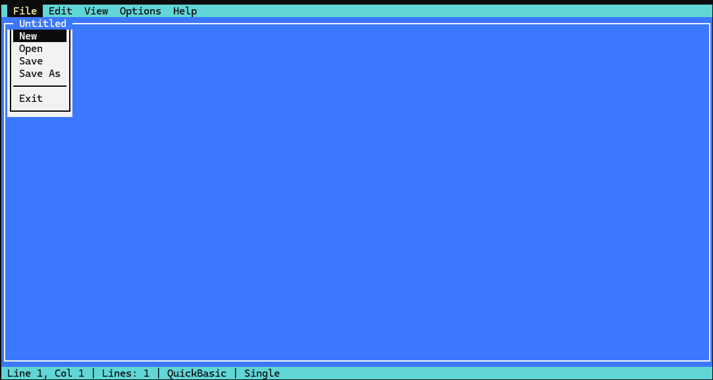

# DotNetVision
What if we asked an AI to implement a TurboVision-like library in C#?

During the DOS era, there were many attempts to create more user-friendly UIs for software developers:
1. Turbo Basic https://winworldpc.com/product/turbo-basic/1x
2. QuickBASIC https://en.wikipedia.org/wiki/QuickBASIC (there was also QuickPascal)
3. Turbo Pascal https://en.wikipedia.org/wiki/Turbo_Pascal

On top of these, two APIs for creating text-mode UIs were developed:
4. TurboVision (for Turbo Pascal/C) https://en.wikipedia.org/wiki/Turbo_Vision
5. Visual Basic for DOS https://winworldpc.com/product/microsoft-visual-bas/10-for-dos

TurboVision is a framework built on OOP principles with relatively modern design patterns (we can see its influence in Delphi, C# WinForms, etc.).

## *Vision in 2025
There is an excellent TurboVision C++ port (the library is now open source) with an outstanding text-based editor that works over SSH:
https://github.com/magiblot/turbo

## DotNetVision
But what if we tried to re-implement it in C#? Especially since .NET Core has quite good cross-platform console support.

I asked GitHub Copilot to do exactly that.

### GPT-4
It didn't really listen to the main prompt and just drew a rectangle with +-------+.

### Sonnet 4
Actually did what I asked. It had several design problems that it couldn't solve initially. For example, flickering (so I had to tell it to use double buffering) and verification of whether/how it works—I had to recommend adding logging to the framework.

But it worked. After multiple iterations and burning through a lot of LLM tokens, it created [DotNetVision](../DotNetVision/README.md).

.

What is interesting, Sonnet4 all by itself added perf tests to the project.

### Gemini
It tried, but got stuck. However, it was very good at refactoring code that had been written by Sonnet 4.

