# Local AI Coding Assistant

TL;DR: Install Visual Studio Code + Continue (plugin) and Ollama + llama3.1 model to get an offline coding assistant on your laptop (as long as it's reasonably modern). This makes it safe for use with medical, defense, and financial data.

## How?

AI coding assistance might not do all the work for you, but it's an excellent tool. 
Microsoft's GitHub Copilot, OpenAI's Codex, Google's Gemini Code Assistant, and Anthropic's Claude Code can all greatly enhance your Visual Studio Code experience. But there's one problem: what if you're not allowed to use these tools?

There are several reasons why you might not want to use public/cloud-based tools. Even if we assume that there are no hostile intentions from the parent companies, and that your conversations won't be used as training data (and this last assumption is questionable), it's still possible that there could be a data leak of historical conversations with LLMs, or that someone might intercept the communication.

So if you're working at a defense company or hedge fund, the risk of revealing secrets in your code (and the agent needs to read all of it to be helpful!) might be too high. And if you're working with medical records, even sharing error messages with ChatGPT to get hints about what's wrong with your data analysis script is risky, because you might inadvertently share patient data. For similar reasons, companies tend to limit access to tools used for proofreading emails, as you don't want trade secrets about a new release to leak, even accidentally.

But this doesn't mean that in such scenarios you're cut off from modern coding assistants or chatbots. You also don't have to copy & paste your code snippets into ChatGPT to get help, or—even worse—take a photo of your computer screen with your smartphone and send the entire picture to ChatGPT for help.

You can run LLM chatbots on your private PC, fully locally, air-gapped—with no internet access required. And it doesn't have to be a super powerful machine; modern laptops are usually sufficient.

## Chatbots

For chatbot-like functionality, I recommend two alternative tools:
a) [GPT4All](https://www.nomic.ai/gpt4all)
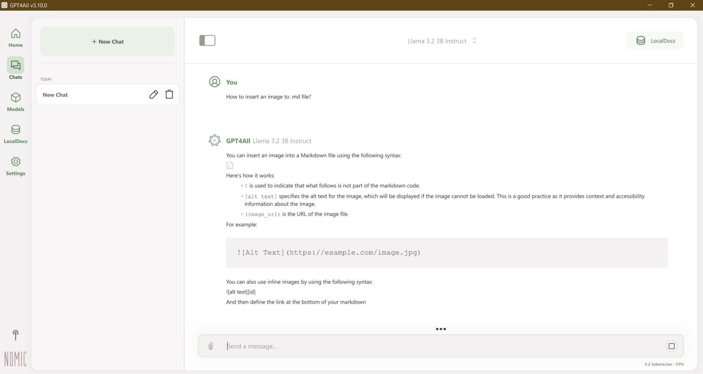
b) [Ollama](https://ollama.com/)
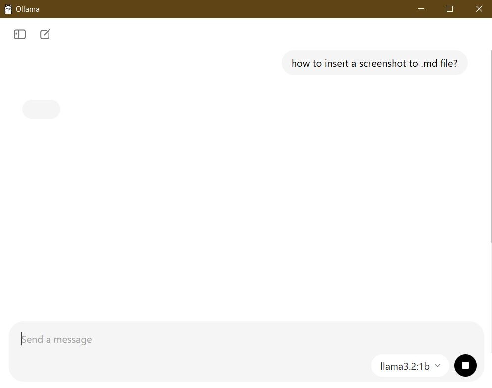
The first one has a better UI; the second can also be used as a local backend for coding agents. These tools support multiple models and GPU acceleration (if available) out-of-the-box.

Models that I recommend trying are:
* Google's Gemma3 - it's multimodal, so you can use both image and text as input
* Deepseek - currently probably the best model to run locally
* Llama3 - from Meta, can be used as a general-purpose model
* Mistral - a European model with less restrictive content filtering

If you're not familiar with LLM models, the "8b" or "12b" indicates model size (billion parameters). Rule of thumb: you need at least 0.5GB (RAM) or 0.8GB (GPU RAM) of memory per billion parameters to run it.

GPT4All has a very straightforward chatbot interface; you simply download it, install it, pick a model, and it will download the model automatically.
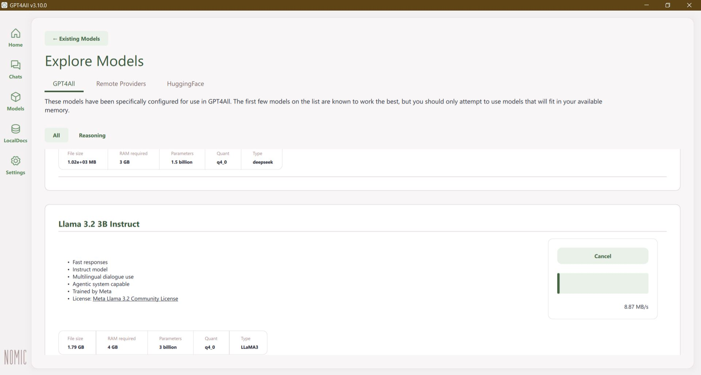

## Local coding assistance

But working with chatbots is a somewhat manual, inefficient way of doing things. Modern coding assistance tools are much more convenient when you're working with code. Instead of copying & pasting between your IDE and a chatbot, you can let the assistant read and modify your code directly.

The setup I tested relies on [Visual Studio Code](https://code.visualstudio.com/). If you've never used it, give it a try—it's an excellent tool. It has support/extensions for multiple languages, including Python, JavaScript, C++, Rust, and some specialized languages used by scientists like R, MATLAB, and Julia.

On top of Visual Studio Code, you need to install an extension called Continue, which is an open-source coding assistant. It supports both external/public backends like ChatGPT, but if you want to use it that way, there are more straightforward tools like GitHub Copilot. The real strength is that [Continue.Dev](https://marketplace.visualstudio.com/items?itemName=Continue.continue) can use a **local** backend. This means none of your data will be sent anywhere, and you can even disable internet on your machine or work from a nuclear submarine.

Continue.Dev supports Ollama as a backend. To use it as an agent rather than just a chatbot, you need to choose a model that supports the *tools* protocol.

I chose Llama3.1:8B since I'm running it on relatively old hardware.

After you've installed Ollama and the model, make sure it's running by using:
```bash
ollama serve
```
It should show something like this:
``` 
Error: listen tcp 127.0.0.1:11434: bind: address already in use
```

This message means that Ollama is already running. 

Then you need to modify the configuration of Continue.Dev and voilà, you can tell your agent to create a Hello World program for you:

As you can see, I have the following models installed:
```bash
$ ollama pull llama3.1:8B
$ ollama pull qwen2.5-coder:1.5b-base
$ ollama pull nomic-embed-text:latest
$ ollama pull deepseek-r1:1.5b
```

Afterwards, you need to set up the VSCode Continue.Dev extension:
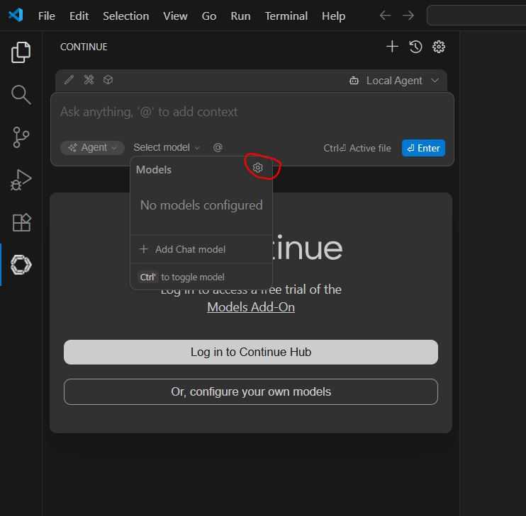
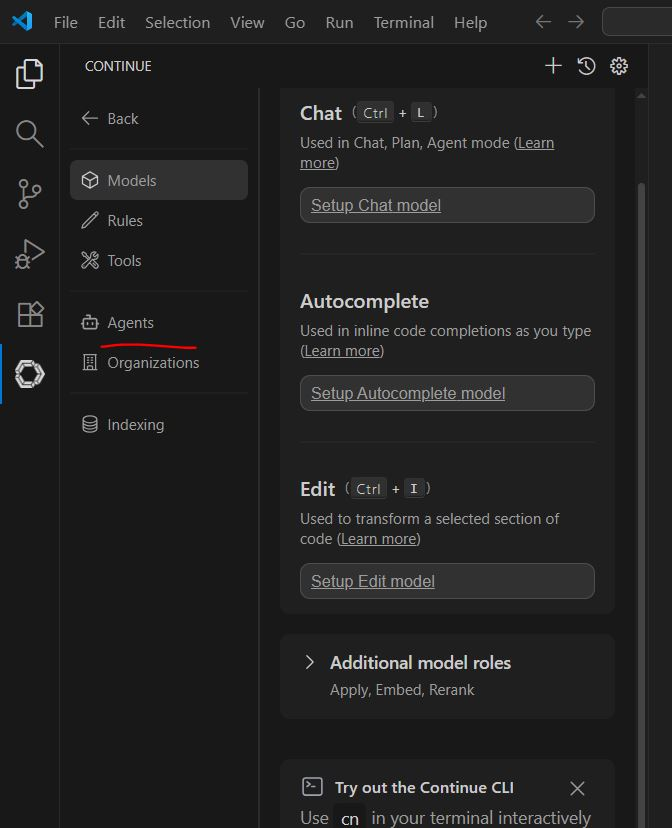
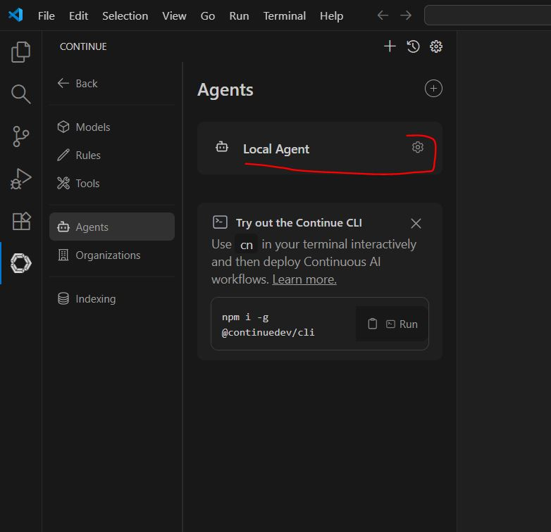
Then you can modify the `.continue/config.yaml` file: 
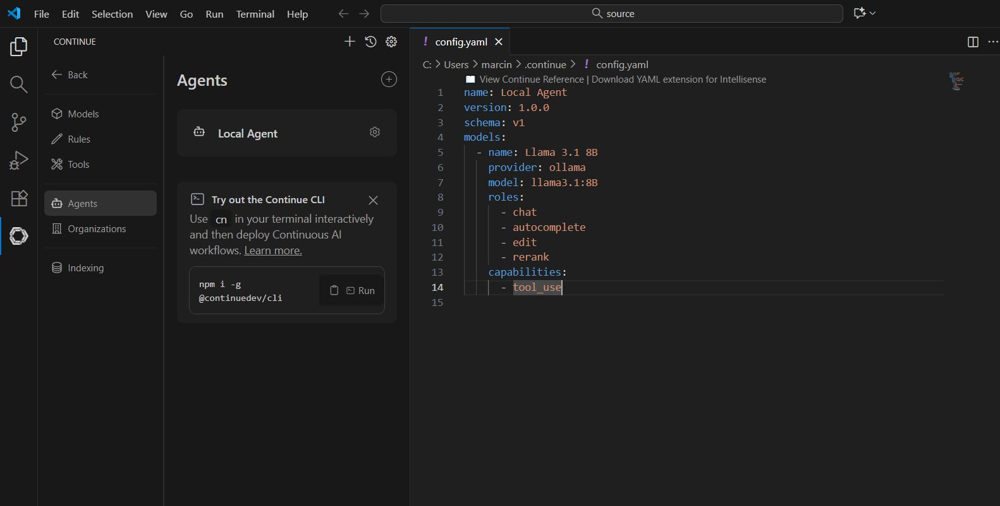
Here's my configuration:
```yaml
name: Local Agent
version: 1.0.0
schema: v1
models:
  - name: Llama 3.1 8B
    provider: ollama
    model: llama3.1:8b
    roles:
      - chat
      - edit
      - apply
  - name: DeepSeek R1 1.5B
    provider: ollama
    model: deepseek-r1:1.5b
    roles:
      - chat
      - edit
      - apply      
  - name: Qwen2.5-Coder 1.5B
    provider: ollama
    model: qwen2.5-coder:1.5b-base
    roles:
      - autocomplete
  - name: Nomic Embed
    provider: ollama
    model: nomic-embed-text:latest
    roles:
      - embed
  - name: Llama 3.1 8B
    provider: ollama
    model: llama3.1:8B
    roles:
      - chat
      - autocomplete
      - edit
      - rerank
    capabilities:
      - tool_use
```


The Continue.Dev extension offers multiple ways to help developers:
a) Local AI-based code completion
b) Ask: chatbot mode
c) Agent/Edit: creating files, running commands
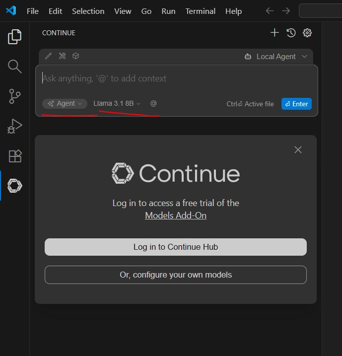


## Hello World and Real-Life Use Cases
### Factorial in C++
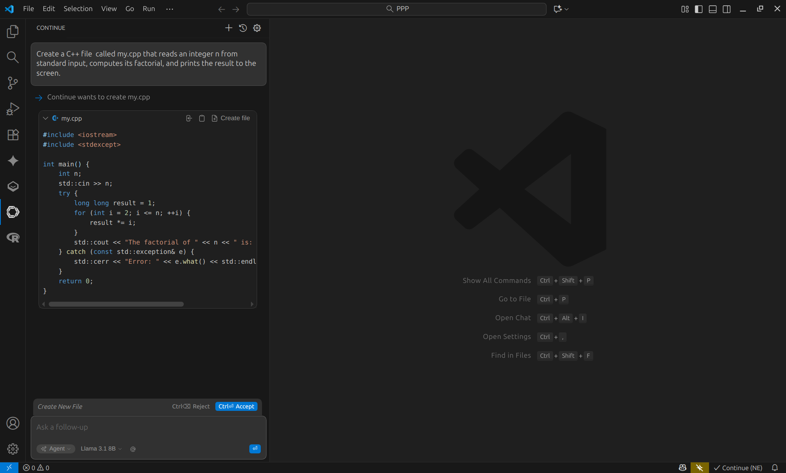
You can see that the generated code is correct, though the comment is slightly wrong—the code uses `long long int`, not `int`.
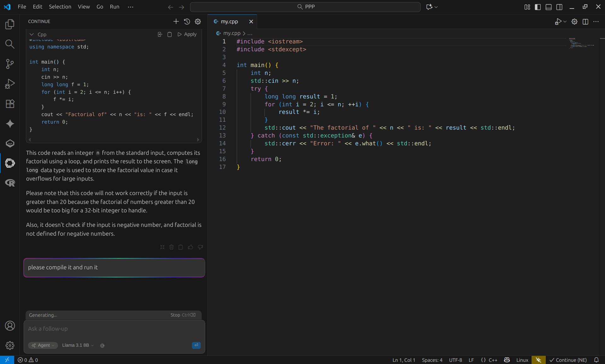
The agent can even compile and run the code automatically:
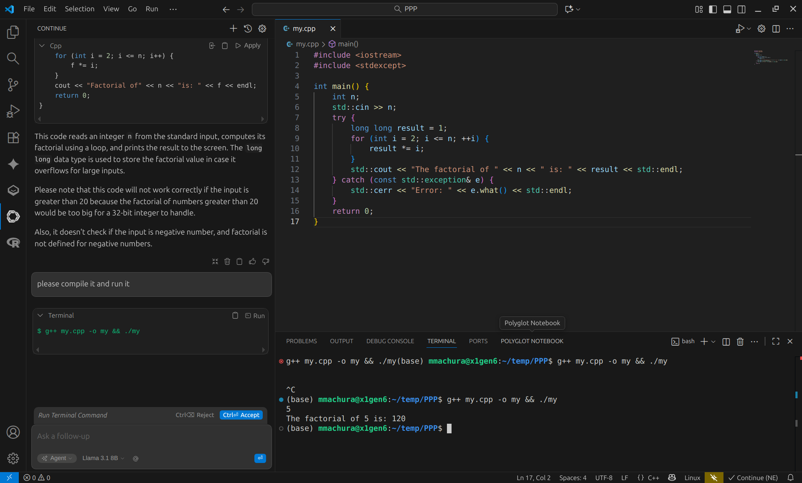

### Help with R
I don't use R, don't know it, and don't particularly like it :)
But I know it's widely used by the biotech research community.

VSCode + Continue.Dev + R Extension gets the job done:
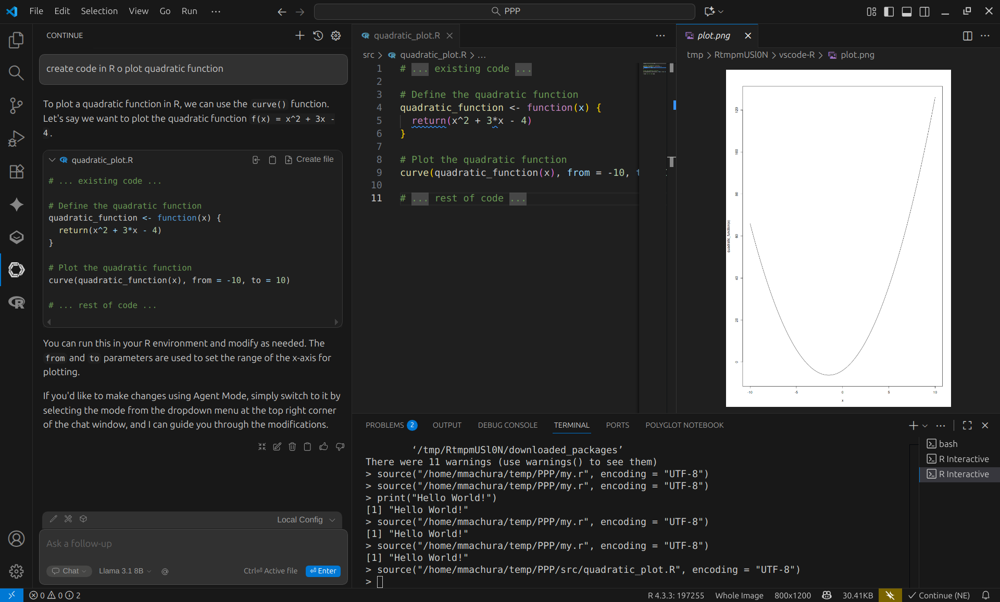
And it's fully local, not sending data anywhere. You could be in Antarctica, disconnected from the grid doing climate research, and still use modern AI :)

## Conclusion / What Else
Unfortunately, my setup was quite slow in agent mode. Chatbots on your local PC are much faster. But if you're working on a secret project for S.P.E.C.T.R.E., they can afford to buy you a new fast laptop (like the latest MacBook with M3 CPU) or a desktop with a nice NVIDIA GPU, or even set up a local GPU cluster to be used exclusively as a coding tool backend.

Obviously, when using these tools, you need to remember that smaller local models can make even more mistakes than the large public ones. But these tools can still be very useful.

Links that are worth trying:
* [Tutorial for Continue.Dev](https://docs.continue.dev/guides/ollama-guide) 
* [R extension for VSCode](https://marketplace.visualstudio.com/items?itemName=REditorSupport.r)
* [Erdos](https://www.lotas.ai/erdos) - R-dedicated VSCode clone with non-local AI coding agent support. 
* [OnPerm LLM](https://amaiya.github.io/onprem/) - tools for powerusers to set up entire RAG locally

