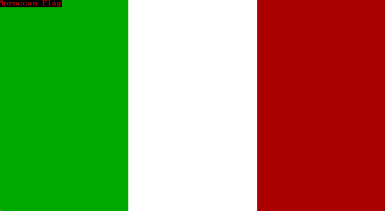
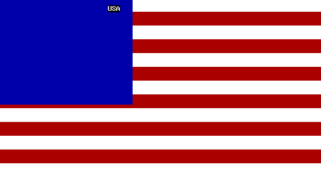

# AI can't whistle....
_..but it can draw._

## Fun with flags
From the outset, I was genuinely impressed by the capabilities of large language models (LLMs). The moment I gained access to ChatGPT, I started experimenting, and it quickly became apparent that this technology holds the potential to revolutionise white-collar work.
But how close are we to reaching a point where we can truly trust LLMs to produce more than just convincing-sounding nonsense?

One of the easiest ways to assess the "hard skills" of LLMs is coding, since it’s a purely text-based activity. However, because these models have been trained on vast amounts of data, I wanted to separate the simple memorization of well-known tasks from genuine reasoning. OpenAI, Google etc. quicky adopted programming contests (such as TopCoder) and maths competitions (IMO) as benchmarks for their models.
Instead of relying solely on their fine-tuning and optimisation, I decided to try something different myself: a *cross-domain problem*. My favourite challenge was: "Please draw(*) the Canadian flag." In this context, "draw" means generating a GW-BASIC programme that renders the Canadian flag.
You could just as well ask for an SVG file, but I find its source code harder to interpret, and in recent times, LLMs have been trained to tackle such tasks. These days, nearly all models can draw the Canadian flag in SVG, but none can manage to replicate it in GW-BASIC.

Why GW-BASIC? Primarily, nostalgia — it was my first programming language, over thirty years ago.
It’s retro computing, but there is actually plenty of information online about how it works. LLMs can write simple programmes in GW-BASIC and grasp all the building blocks needed to create vector graphics in the language.
The language itself is quite straightforward, with a short list of statements, no external libraries, and support for both graphical output and playing musical notes.

I’ve got to admit, lately I’m genuinely impressed. LLMs have come a long way when it comes to drawing in GW-BASIC. Everything actually runs now, and most of the flags are easy enough to recognise, even without any corrections. It’s still not as good as when these models generate SVGs, but the progress is pretty impressive.
To make things a bit more interesting, I tried asking the model to play a national anthem too. That’s where things get so bad that it is hilarious, clearly, there’s still a lot of work to do here. Maybe another benchark for playing MusiXTeX files?:)

## The Problem
I create a simple prompt: 

_"Please create a GW-BASIC program poland.bas which draws (in EGA(*) mode) Polish flag and plays (with PLAY command) Polish anthem"._

The comparison was conducted using GitHub Copilot Agent and the latest models: Sonnet4,Gemini 2.5 Pro, GPT4.1, and GPT4o. The evaluation included flag designs from several countries: Poland, France, and Germany (simple flags), the UK, Canada, and USA (complex flags), as well as Vietnam and Morocco (simple flags featuring one moderately complex element).

(*) EGA is an old graphics card, pretty much it is a way of saying to GW-BASIC/LLM that I want it to be high resolution and in color (640x350x16).

Most programs were generated successfully on the first try. However, I occasionally had to prompt (mostly GPTs) to fix minor syntax errors, such as using numbered empty lines or disallowed variable names.

## Solutions
My [source code](https://github.com/marcinmachura/MeVsAi/tree/main/FunWithFlags/) can be downloaded and tested locally. Just download [doxbox](https://www.dosbox.com/), [GW-Basic](https://gw-basic.com/) and you can run it with the following command:
> dosbox -noconsole -c "mount c ." -c "c:" -c "GWBASIC.EXE canada.bas"
 
### TL;DR
GPT4o < GPT4 < Gemini <= Sonnet4

Also GPT4.1 hanged once during code generation.

| Country   | Sonnet 4 | Gemini | GPT 4o | GPT 4.1 |
|-----------|----------|--------|--------|---------|
| **Canada**   |   |   |      |          |
| **France**   |   |   |      |          |
| **Germany**  |  |  |     |         |
| **Morocco**  |  |  |     |         |
| **Poland**   |   |   |      |          |
| **UK**       |       |       |          |              |
| **USA**      |      |      |         |             |
| **Vietnam**  |  |  |     |         |

### Anthems and other issues
The anthems were mostly horribly wrong(*), but the UK and USA versions were more memorable since I could recognize their opening bars in both Sonnet4 and Gemini4. 

Interestingly, both Gemini and GPT4o played "Ode to Joy" instead of Germany's actual anthem, which is a political statement:) since it's the EU anthem. It was also the most accurate musically.

Sometimes, like with Poland+Sonnet4 and UK+Sonnet4, the programs drew flags pixel by pixel rather than using line or box commands, which slowed things down; LINE was used more often than the more versatile DRAW command. 

(*) I didn't compare the Vietnamese and Moroccan anthems, as I'm not familiar with their melodies.

### Other
With Sonnet4 I also tried GDR/DDR and Stark banner/Game of Thrones melody. Genereted code is there.

## Disclamer
It is not a real research project. I tried generation once, without controlling parameters of the model.

Contact: Marcin Machura <marcin.machura@hotmail.com>

