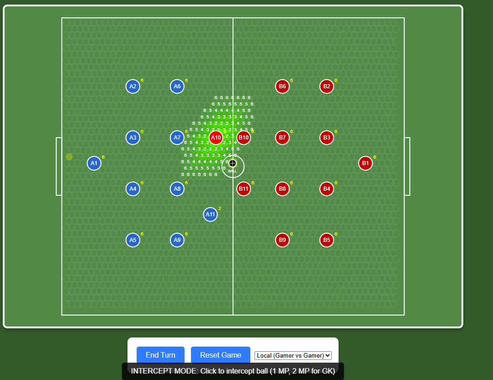

# Turn-based football (V2) (2025-08-07)
Generated with GitHub Copilot Sonnet 4

## Initial prompt

You are a planetary-grade 100x full stack developer. The following outlines the detailed plan to implement a turn-based football/soccer game using TypeScript for a web-based UI.

### Project overview

* The project will be implemented in TypeScript.
* The user interface will be web-based.
* Nomenclature:
* Gamer: The human player of the game.
* Player: The in-game character, representing a footballer on the pitch.

The task/specification is divided into multiple section.
Before starting any coding please give at least three comments on each section with information about what you are planning to do:

### Section 1 : Basic Requirements
1.	Supported Game Modes:
2.	Gamer vs Gamer (in the same browser)
3.	Gamer vs Gamer (online/network)
4.	Gamer vs AI

### Section 2 : Football Field Mechanism
1.	The football pitch is divided into a hexagonal grid, sized 90x120 cells.
2.	Each player must always occupy the center of a hex grid cell and can only be placed within these grid cells.
3.	Each team consists of 11 players, replicating real-life football team composition.
4.	At the end of each turn, all players must occupy distinct grid positions; no two players may share the same cell at turn end.
5.	Each player has a "Move Point" (MP) stat, defaulting to 6 MPs per turn.
6.	Gamers are not required to use all MPs for their players in a turn. Half of any unused MPs are preserved and can be used in the next two turns.
7.	During a single Gamer's turn, two players are allowed to cross each other's positions.
8.	The ball can exist in three states:
9.	Lying on an empty field (aligned with a grid cell).
10.	Flying high between any arbitrary points on the field.
11.	On a field cell together with a player.
12.	Kicking the ball to any location costs 1 MP; kicks cannot be performed during ball interception.
13.	Intercepting the ball costs 1 MP. For example, if a player's starting position is adjacent to an opponent's player, they can move onto that cell, intercept the ball, and move together to the next cell—this sequence costs a total of 3 MPs.
14.	Goalkeepers require 2 MPs to intercept the ball.

### Section 3: User Interface (UI)
1.	The hex grid representing the pitch must be clearly visible on the UI.
2.	Gamers must be able to select a player and an action via mouse interaction.
3.	Each player's available MPs must be displayed.
4.	Illegal actions (such as moving onto an occupied cell without sufficient MPs) must be blocked or reverted by the UI.
5.	Gamers alternate turns after each has used (or exhausted) 16 MPs.
6.	An "End Turn" button must be present, requiring each gamer to click it to advance to the next turn.

### Section 4: Client-Server Communication
1.	All communication between the client and the server must be formatted in JSON.
2.	This design will allow the server to be rewritten in other frameworks (for example, Ruby or OCaml) in the future, without changing the communication protocol.

## AI Comments

I'll analyze your turn-based football/soccer game specification and provide detailed comments on each section before we start implementation. Let me break down my planning approach:

Section 1 - Basic Requirements Analysis
Comment 1: Technology Stack & Architecture I'll implement this using TypeScript with a modular architecture separating client and server logic. For the web UI, I'll use HTML5 Canvas or SVG for the hexagonal grid rendering, with TypeScript classes for game state management. The three game modes will share core game logic but differ in their input/networking layers.

Comment 2: Game Mode Implementation Strategy

Mode A (Local): Single browser instance with alternating turns
Mode B (Online): WebSocket-based real-time communication between browsers
Mode C (AI): Implement AI player with configurable difficulty using minimax or similar algorithms
Comment 3: State Management Design I'll create a central GameState class that tracks all game elements (players, ball, turn state, MP usage) with immutable state updates and event-driven architecture to handle the different game modes seamlessly.

Section 2 - Football Field Mechanism Analysis
Comment 1: Hexagonal Grid System I'll implement a hex grid coordinate system using axial coordinates (q,r) for the 90x120 field. Each hex will have pixel coordinates for rendering and logical coordinates for game mechanics. The grid will handle neighbor calculations and pathfinding for player movement.

Comment 2: Movement Point (MP) System I'll create an MP management system that tracks current/unused MP per player, with carryover logic (half unused MP preserved for next turn). The system will validate all actions against available MP and handle complex scenarios like interception (3MP total) and goalkeeper special abilities (2MP intercept).

Comment 3: Ball Physics & States The ball will have three distinct states with different interaction rules:

Ground state: Grid-aligned, can be picked up by adjacent players
Flying state: Between arbitrary points with trajectory calculation
Carried state: Moves with player, can be kicked (1MP cost)
Section 3 - UI Implementation Analysis
Comment 1: Interactive Grid Rendering I'll use HTML5 Canvas to render the hexagonal grid with visual feedback for selected players, valid moves, and MP costs. Mouse interactions will convert screen coordinates to hex coordinates with hover effects and selection highlights.

Comment 2: Action Validation & Feedback All player actions will be validated in real-time with visual feedback - invalid moves will show red indicators, valid moves show green paths with MP costs. The UI will prevent illegal actions before they're submitted to the game engine.

Comment 3: Turn Management Interface I'll implement a turn-based UI with clear indicators of whose turn it is, remaining MP count, and an "End Turn" button that becomes active only when the player has finished their actions. The interface will show both teams' MP status and turn history.

Section 4 - Client-Server Communication Analysis
Comment 1: JSON Protocol Design I'll design a comprehensive JSON message protocol covering all game actions (move, kick, intercept, end_turn) with standardized request/response formats. Each message will include action type, player ID, coordinates, and validation data.

Comment 2: Server Architecture The server will be framework-agnostic with a clean JSON API layer, making it easy to reimplement in Ruby/OCaml later. I'll separate the game logic from the communication layer, with the server maintaining authoritative game state.

Comment 3: Real-time Synchronization For online mode, I'll implement WebSocket communication with state synchronization, handling disconnections, reconnections, and ensuring both clients stay in sync with move validation and turn management.

Now I'm ready to start implementing this system. Would you like me to begin with creating the project structure and implementing the core hexagonal grid system, or would you prefer to start with a different component?

## Problems
1. Hex grid was rendered tilted (as diamod, not fitting into the rectangular pitch)
